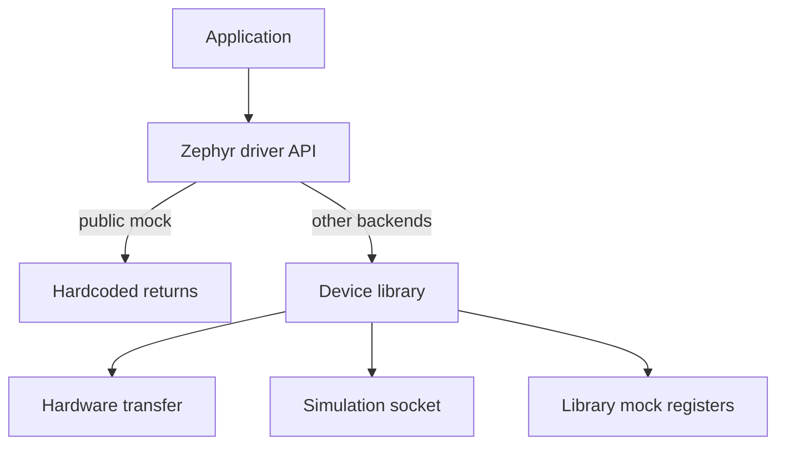

# driver-template

Template repository for PerovSat Zephyr out-of-tree drivers. Clone this repo to create a new device driver with boilerplate already in place.

## Quick start

```bash
git clone git@github.com:PEROVSAT/driver-template.git my-new-driver
cd my-new-driver
source .venv/bin/activate   # required — setup.py exits early without a venv
python setup.py
```

`setup.py` will ask for:

| Prompt | Example | Notes |
|--------|---------|-------|
| device-model | `mpu6050` | Lowercase slug for filenames, C symbols, and compatible |
| devicetree-vendor | `invensense` | Devicetree compatible prefix (not `zephyr`) |
| zephyr-subsystem | `sensor` | Zephyr driver subdirectory (default: `sensor`) |

After setup, tokenized paths and file contents are renamed in place, `README.driver.md` is promoted to `README.md`, and `setup.py` is removed. Wire the new driver into `perovsat-app` (see the generated `README.md` checklist).

## Architecture

Every device repo follows the same **library-wrapper** model inspired by [amulib](https://github.com/the-aerospace-corporation/amulib):

- **`lib/<device>/`** — portable protocol logic with an injected byte-transfer function pointer
- **`drivers/<subsystem>/<device>/`** — thin Zephyr wrapper that binds the library and exposes the driver API
- **Four backends** selected at build time via Kconfig



### Backends

| Backend | Library | Description |
|---------|---------|-------------|
| **Hardware** | Yes | Real bus (I2C by default; UART for NDA devices) |
| **Simulation** | Yes | Socket to Basilisk for SITL |
| **Library mock** | Yes | Static register map via injected transfer fn |
| **Public mock** | No | Hardcoded API returns; default and NDA-safe |

## What gets generated

Each bootstrapped repo is a Zephyr out-of-tree module with:

- `zephyr/module.yml` — west module declaration
- Top-level `Kconfig` and `CMakeLists.txt`
- Device library under `lib/<driver>/`
- Zephyr wrapper under `drivers/<subsystem>/<driver>/`
- Three transfer backends: `_hardware.c`, `_simulation.c`, `_library_mock.c`
- Devicetree binding under `dts/bindings/<subsystem>/`
- Twister tests under `tests/{unit,public_mock,library_mock,simulation}/`
- Inline `TODO` comments marking where device-specific logic goes

## Token reference

`setup.py` substitutes these placeholders in paths and file contents:

| Token | Example |
|-------|---------|
| `__MODULE_NAME__` | `mpu6050-driver` |
| `__VENDOR__` | `invensense` |
| `__DRIVER_SLUG__` | `mpu6050` |
| `__DRIVER_UPPER__` | `MPU6050` |
| `__COMPAT__` | `invensense,mpu6050` |
| `__DT_COMPAT__` | `invensense_mpu6050` |
| `__KCONFIG_SYM__` | `PEROVSAT_MPU6050` |
| `__SUBSYS__` | `sensor` |

## Typical workflow

1. Clone `driver-template` once per physical device.
2. Run `setup.py` and answer the prompts.
3. Implement protocol logic in `lib/<device>/` and the Zephyr API in `drivers/`.
4. Add the new west project and dbuild snippets in `perovsat-app`.
5. Build with `west dbuild -b <board>` and select the backend via Kconfig.

For NDA devices, move `lib/<device>/` to a private west module later; the public repo continues to build with public mock.
